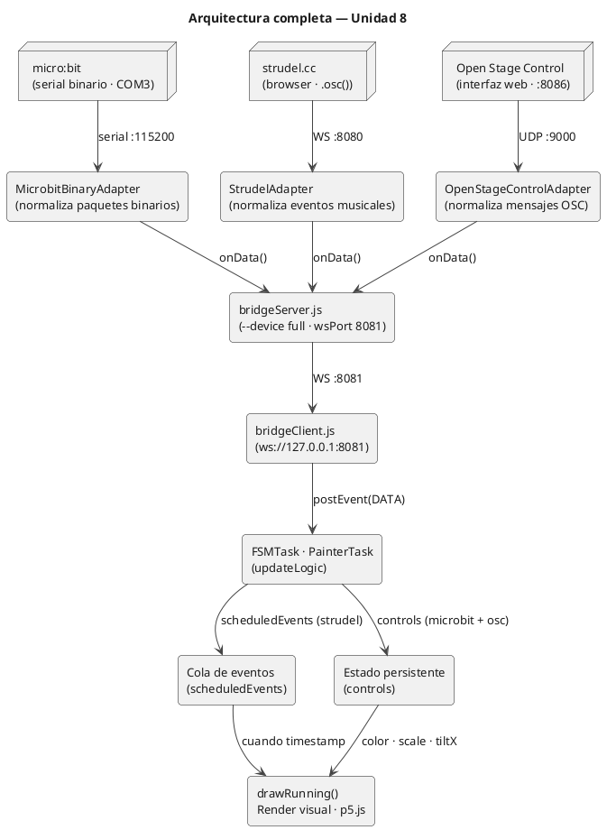

# Bitácora — Unidad 8
**Sistemas Físicos Interactivos 1 · 2026-10**
**Proyecto: sfi1-2026-20-u4-CaseStudy**
 
---
 
## Actividad 01 — Iteración ingenieril
 
### Diagrama inicial de la arquitectura
 

 
---
 
### Adapters utilizados
 
| Adapter | Fuente | Protocolo |
|---|---|---|
| `MicrobitBinaryAdapter` | micro:bit | Serial binario con checksum · 115200 baud |
| `StrudelAdapter` | Strudel | WebSocket en puerto 8080 |
| `OpenStageControlAdapter` | Open Stage Control | UDP en puerto 9000 |
 
---
 
### Contrato de mensajes de cada fuente
 
**micro:bit → bridgeServer**
 
Paquete binario de 8 bytes enviado a 30 Hz:
 
```
[0xAA] [x_hi] [x_lo] [y_hi] [y_lo] [btnA] [btnB] [checksum]
```
 
- `x`, `y`: Int16 big-endian (acelerómetro, rango ~-1024 a 1024)
- `btnA`, `btnB`: `0x00` o `0x01`
- `checksum`: `(x_hi + x_lo + y_hi + y_lo + btnA + btnB) & 0xFF`
Mensaje normalizado que llega al frontend:
```json
{ "type": "microbit", "x": 234, "y": -512, "btnA": false, "btnB": true, "t": 1715000000000 }
```
 
**Strudel → bridgeServer**
 
```json
{
  "type": "strudel",
  "timestamp": 1715000000100,
  "payload": { "sound": "tr909bd", "family": "bd", "delta": 0.47 }
}
```
 
**Open Stage Control → bridgeServer**
 
```json
{ "type": "osc", "payload": { "address": "/rgb_1", "args": [103, 101, 101] } }
```
 
---
 
### Pruebas técnicas básicas de integración
 
**Prueba 1 — micro:bit llega al frontend**
- Se inició `bridgeServer.js --device full --serialPort COM3`
- Se abrió el sketch en el navegador y se presionó Connect
- Se verificó en consola del navegador que aparecía `BRIDGE STATUS: connected serial open COM3 @115200`
- Confirmado: los datos del micro:bit llegan a `updateLogic`
**Prueba 2 — Strudel activa eventos visuales**
- Se ejecutó el patrón house en Strudel con `.osc()`
- Se verificó que los hexágonos aparecían sincronizados con el audio
- Confirmado: bombo, caja, hi-hat y open hi-hat disparan sus animaciones
**Prueba 3 — OSC modifica parámetros persistentes**
- Se abrió Open Stage Control con los 4 widgets RGB
- Se movió el widget `rgb_1` y se verificó que el color del bombo cambiaba en tiempo real
- Confirmado: los mensajes OSC llegan a `updateControls` y modifican `controls.colors`
**Prueba 4 — micro:bit modifica el sistema visual**
- Se presionó botón A: los hexágonos crecieron progresivamente
- Se presionó botón B: los hexágonos volvieron a tamaño normal
- Se inclinó hacia la derecha: el color se desplazó hacia rosa/cálido
- Se inclinó hacia la izquierda: el color se desplazó hacia azul/frío
- Confirmado: el micro:bit modifica el sistema visualmente
**Prueba 5 — Las tres fuentes conviven sin bloqueos**
- Se corrieron los tres adapters simultáneamente
- Se verificó que no había desconexiones ni interferencias entre fuentes
- Confirmado: el sistema es estable con las tres fuentes activas
---
 
### Errores encontrados y soluciones
 
**Error 1:** `Cannot find module 'bridgeServer.js'`
- **Causa:** El comando se ejecutó desde `~` en lugar de la carpeta del proyecto.
- **Solución:** Navegar con `cd ~/sfi1-2026-20-u4-CaseStudy` antes de ejecutar.
**Error 2:** `WebSocket connection to 'ws://127.0.0.1:8081/' failed`
- **Causa:** El `bridgeServer.js` tenía el bloque `--device full` pero el archivo viejo estaba en disco. El servidor arrancaba pero los adapters no se inicializaban correctamente.
- **Solución:** Reemplazar el `bridgeServer.js` con la versión actualizada que tiene el bloque `full`.
**Error 3:** El color picker de Open Stage Control ponía las formas en negro
- **Causa:** El `OpenStageControlAdapter` entrega los datos sin `type: "osc"` — solo entrega `{ address, args, from }`. El `onData` del `bridgeServer.js` verificaba `d.type === "osc"` que siempre era `false`, por lo que los mensajes OSC caían al bloque de microbit y se retransmitían mal.
- **Solución:** Cambiar el `onData` del `bridgeServer.js` para detectar el tipo de adapter por instancia (`instanceof OpenStageControlAdapter`) y agregar `type: "osc"` manualmente al retransmitir.
**Error 4:** Las direcciones OSC llegaban con barra (`/rgb_1`) pero el sketch comparaba sin barra (`rgb_1`)
- **Causa:** El `OpenStageControlAdapter` tiene una función `normalizeAddress` que quita la barra, pero el `bridgeServer.js` retransmitía el objeto `d` directamente sin pasar por esa normalización en algunos casos.
- **Solución:** En el `bridgeServer.js`, al retransmitir el mensaje OSC, se usa `d.address` directamente (que ya viene normalizado del adapter) y se envuelve en `payload`.
**Error 5:** Open Stage Control enviaba valores RGB como decimales (ej. `103.15`, `106.01`)
- **Causa:** Open Stage Control internamente maneja colores con precisión decimal.
- **Solución:** El `OpenStageControlAdapter` ya aplica `Math.round()` a todos los valores numéricos antes de retransmitirlos, convirtiendo `103.15` en `103`.
**Error 6:** El micro:bit aparecía en COM3 pero el comando usaba COM4
- **Causa:** En este computador el micro:bit se asignó al puerto COM3 en lugar de COM4.
- **Solución:** Verificar el puerto en el Administrador de dispositivos de Windows y usar `--serialPort COM3`.
---
 
## Actividad 02 — Iteración estética
 
### Concepto de la obra
 
La obra es una **performance audiovisual house/dance** de carácter geométrico y
neón. El concepto explora la relación entre el pulso mecánico del house (4 en el
piso, patrones rítmicos regulares) y la geometría hexagonal como metáfora de
organización y energía colectiva. El performer controla el tamaño de las formas
con gestos corporales (micro:bit) mientras el sistema musical genera las visuales
en tiempo real y Open Stage Control permite modificar la paleta de color.
 
La propuesta tiene influencia del live coding audiovisual de la escena Algorave
y de la estética visual del techno europeo — formas geométricas precisas,
colores neón sobre negro, pulso constante.
 
---
 
### Rol de cada fuente dentro de la obra
 
| Fuente | Rol en la obra | Justificación |
|---|---|---|
| **micro:bit** | Control físico gestual. Botón A agranda todas las formas gradualmente, botón B las achica. La inclinación en eje X desplaza el tono de color (izquierda = azul/frío, derecha = rosa/cálido). | El gesto corporal del performer es directamente perceptible en pantalla. El tamaño y el tono cromático cambian con el movimiento del cuerpo. |
| **Strudel** | Motor musical y disparador de eventos visuales temporizados. Cada familia de sonido activa una forma geométrica distinta sincronizada con el audio. | La imagen responde directamente al ritmo, creando sincronía audiovisual. |
| **Open Stage Control** | Control paramétrico persistente. 4 widgets RGB controlan el color de cada familia de sonido en tiempo real. | Permite cambiar la paleta cromática completa durante la performance sin interrumpir el sistema. |
 
---
 
### Decisiones visuales
 
- **Bombo (`bd`):** Hexágono grande que crece desde el centro — el impacto del kick se traduce en la forma más estructurada y dominante.
- **Caja (`sd`):** 6 líneas radiales que explotan desde el centro — energía dispersa que contrasta con la solidez del hexágono.
- **Hi-hat (`hh`):** Hexágono pequeño en posición aleatoria — textura repetitiva que cubre el espacio.
- **Open hi-hat (`oh`):** Rombo rotante que se contrae — figura diferenciada para el acento más espaciado.
- **Other:** Espiral de puntos que se expande para sonidos no clasificados.
La paleta neón sobre negro (verde, rosa, azul, amarillo) hace referencia a la
estética visual del techno y el live coding performático.
 
---
 
### Decisiones musicales
 
Patrón house a 128 BPM (0.533 cps):
 
```javascript
setcps(0.533)
const kick  = s("bd*4").bank("tr909")
const snare = s("~ sd ~ sd").bank("tr909")
const hats  = s("hh*8").bank("tr909")
const oh    = s("~ ~ oh ~").bank("tr909")
 
$: stack(
  kick.gain(0.9),
  snare.gain(0.75),
  hats.gain(0.5),
  oh.gain(0.65),
  stack(kick, snare, hats, oh).osc()
)
```
 
---
 
### Decisiones performáticas
 
- El performer tiene el micro:bit en la mano izquierda y el mouse en la derecha para controlar Open Stage Control.
- El live coding de Strudel se prepara antes de la performance y se ejecuta con un solo play al inicio.
- El tamaño de las formas varía con los botones A y B para crear momentos de tensión y calma.
- La inclinación del micro:bit genera transiciones cromáticas continuas.
- Los 4 color pickers de OSC se modifican en momentos clave para crear cambios de sección perceptibles.
---
 
### Cambios entre iteración ingenieril e iteración estética
 
| Cambio | Razón |
|---|---|
| Se eligió hexágono como forma base | Más coherente con la estética geométrica y diferenciada |
| Se agregó desplazamiento de tono por acelerómetro X | El color como gesto continuo es más expresivo |
| Se separaron `hh` y `oh` con formas distintas | El open hihat merece su propia forma por ser un acento diferenciado |
| Se usó lerp para suavizar scale y tiltX | Evita saltos bruscos durante la performance |
| Se ampliaron los controles OSC de 2 a 4 widgets | Controlar cada familia de sonido independientemente |
 
---
 
### Evidencias de ensayo
 
- Se realizó un ensayo completo con los tres sistemas corriendo simultáneamente.
- Se verificó que el micro:bit en COM3 mantiene conexión estable.
- Se verificó que los tres adapters conviven sin bloqueos.
- Se ensayó el cambio de colores en OSC con los 4 widgets mientras Strudel corría.
- Se ensayó la variación de escala con botones A y B durante la performance.
---
 
## Actividad 03 — Revisión técnica y sustentación
 
### 1. Diagrama completo del flujo de datos del sistema
 
```
┌──────────────────┐     ┌─────────────────────────────┐
│    micro:bit     │─────▶  MicrobitBinaryAdapter       │
│ serial · COM3    │     │  verifica checksum, normaliza│
│ 30 Hz · binario  │     └──────────────┬──────────────┘
└──────────────────┘                    │ onData()
                                        ▼
┌──────────────────┐     ┌─────────────────────────────┐
│   strudel.cc     │─────▶  StrudelAdapter              │
│ WS · puerto 8080 │     │  normaliza eventos musicales │
└──────────────────┘     └──────────────┬──────────────┘
                                        │ onData()
                                        ▼
┌──────────────────┐     ┌─────────────────────────────┐
│ Open Stage Ctrl  │─────▶  OpenStageControlAdapter     │
│ UDP · puerto 9000│     │  normaliza mensajes OSC      │
└──────────────────┘     └──────────────┬──────────────┘
                                        │ onData()
                                        ▼
                         ┌─────────────────────────────┐
                         │  bridgeServer.js             │
                         │  --device full · WS :8081    │
                         │  detecta adapter por         │
                         │  instanceof y agrega type    │
                         └──────────────┬──────────────┘
                                        │ WebSocket :8081
                                        ▼
                         ┌─────────────────────────────┐
                         │  bridgeClient.js             │
                         │  inspecciona msg.type        │
                         │  microbit|strudel|osc        │
                         │  dispara postEvent(DATA)     │
                         └──────────────┬──────────────┘
                                        │ postEvent
                                        ▼
                         ┌─────────────────────────────┐
                         │  FSMTask · PainterTask       │
                         │  updateLogic()               │
                         └──────┬───────────────┬───────┘
                                │               │
                    ┌───────────▼───┐   ┌───────▼──────────────┐
                    │ scheduledEvts │   │ controls             │
                    │ (Strudel)     │   │ scale · tiltX · color│
                    │ por timestamp │   │ (microbit + OSC)     │
                    └───────┬───────┘   └───────┬──────────────┘
                            │                   │
                            └─────────┬─────────┘
                                      ▼
                         ┌─────────────────────────────┐
                         │  drawRunning()               │
                         │  hexágonos · líneas · rombos │
                         │  solo dibuja, no decide      │
                         └─────────────────────────────┘
```
 
---
 
### 2. Tabla con el rol de cada fuente
 
| Fuente | Qué controla | Cómo entra al sistema | Por qué |
|---|---|---|---|
| **micro:bit** | Tamaño global (botones A/B) y tono de color por inclinación eje X | Serial binario → `MicrobitBinaryAdapter` → `bridgeServer` → `bridgeClient` → `updateLogic` → `_rawScale` y `_rawTiltX` | El gesto corporal modifica la percepción de energía de la obra en tiempo real. |
| **Strudel** | Disparador de eventos visuales temporizados por familia de sonido | WS :8080 → `StrudelAdapter` → `bridgeServer` → `bridgeClient` → `updateLogic` → `scheduledEvents` → `activeAnimations` | El `timestamp` garantiza que la forma aparece exactamente cuando suena el golpe. |
| **Open Stage Control** | Color base de cada familia (`/rgb_1` a `/rgb_4`) | UDP :9000 → `OpenStageControlAdapter` → `bridgeServer` → `bridgeClient` → `updateLogic` → `updateControls` → `controls.colors` | Permite cambiar la paleta cromática completa en tiempo real sin interrumpir el sistema. |
 
---
 
### 3. Recorrido completo de la arquitectura
 
`Adapter → bridgeServer → bridgeClient → FSMTask → updateLogic → drawRunning`
 
1. **Adapter:** Cada fuente tiene su propio adapter. Recibe datos crudos, los normaliza y llama a `this.onData?.()`. El `MicrobitBinaryAdapter` verifica el checksum. El `StrudelAdapter` agrega `type: "strudel"`. El `OpenStageControlAdapter` redondea los valores decimales a entero.
2. **bridgeServer.js:** Concentrador y distribuidor. Con `--device full` instancia los tres adapters. Detecta cada adapter por `instanceof` para retransmitir con el `type` correcto: `"microbit"`, `"strudel"` u `"osc"`. No contiene lógica de dominio.
3. **bridgeClient.js:** Mantiene la conexión WebSocket. Reconoce `msg.type === "microbit"`, `"strudel"` u `"osc"` y llama al callback `onData` que dispara `postEvent({type: DATA, payload: msg})`.
4. **FSMTask / PainterTask:** Coordina el sistema. Delega los eventos `DATA` a `updateLogic`. No parsea mensajes de red.
5. **updateLogic():** Para `microbit` actualiza `_rawScale` y `_rawTiltX`. Para `strudel` agrega a `scheduledEvents`. Para `osc` llama a `updateControls` que actualiza `controls.colors`.
6. **drawRunning():** Lee el estado calculado y dibuja. No toma decisiones de lógica.
---
 
### 4. Justificación de la propuesta estética y performática
 
La propuesta toma la estética del **techno geométrico y el live coding audiovisual**
como referente. El hexágono como forma base no es arbitrario — es la figura que
más eficientemente cubre un plano y aparece en estructuras naturales y moleculares.
En la performance representa el sistema organizado que el performer escala o
comprime con los botones.
 
La inclinación del micro:bit como control de tono cromático permite que el
performer "pinte" con su cuerpo — la transición entre azul frío y rosa cálido
es un gesto continuo y expresivo.
 
Los 4 controles de color OSC permiten transformar completamente la paleta de la
performance durante la ejecución, creando arcos cromáticos que acompañan la
evolución musical.
 
---
 
### 5. Evidencias de pruebas y ensayos
 
- Se verificó que los tres adapters arrancan correctamente con `--device full`.
- Se confirmó que el micro:bit en COM3 envía datos continuos a 30 Hz.
- Se verificó la sincronía audiovisual de Strudel con los hexágonos.
- Se ensayó el cambio de escala con botones A/B durante la performance.
- Se verificó que la inclinación del micro:bit produce transiciones cromáticas suaves gracias al `lerp` en cada frame.
- Se verificó que los 4 color pickers de OSC modifican los colores correctamente después de corregir el bug de `type: "osc"` en el `bridgeServer.js`.
---
 
### Comando de arranque
 
```bash
cd ~/sfi1-2026-20-u4-CaseStudy
node bridgeServer.js --device full --wsPort 8081 --strudelPort 8080 --oscPort 9000 --serialPort COM3 --verbose
```
 
Luego:
1. Abrir Open Stage Control con los 4 widgets RGB
2. Abrir `index.html` con Live Server
3. Ir a strudel.cc, pegar el patrón y dar play
4. Presionar Connect en el navegador
---
 
*Bitácora completa — Unidad 8*
